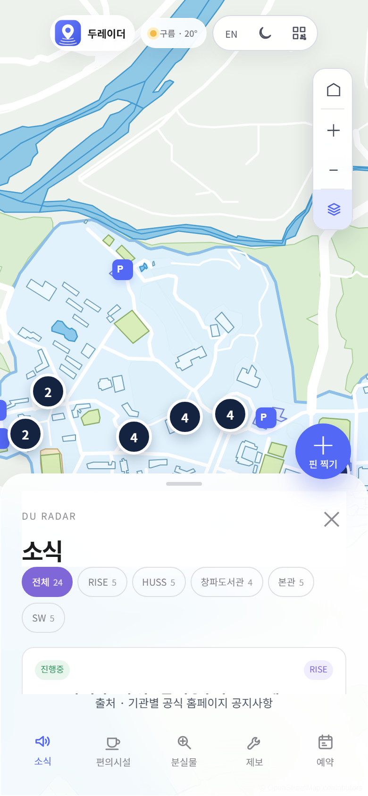
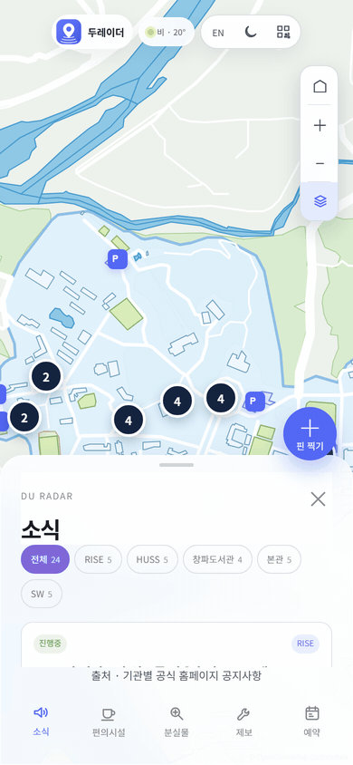

# 두레이더 (DU Radar)

대구대학교 경산캠퍼스 지도 위에 학교 정보를 핀으로 모은 웹앱이다.
2026년 9월 17~18일 대구대 바이브코딩 해커톤에 6팀으로 나가서 1박 2일 동안 만들었고, 9월 18일에 발표했다.


 

## 왜 만들었나

학교 다니면서 불편했던 걸 그대로 주제로 잡았다.

사업단 공지를 보려면 RISE, SW중심대학, HUSS, 도서관, 본부 사이트를 하나씩 들어가야 한다. 어느 건물 몇 층에 라운지가 있는지, 몇 시까지 여는지 한눈에 보는 곳이 없다. 학교가 주는 캠퍼스 지도는 PDF 한 장이라 눌러지지도 않는다.
운동장 예약은 학교 사이트에서 되긴 하는데 이름과 시간만 나오고, 제2운동장이 어디 있는 건지는 안 나온다.

이걸 지도 한 장에 다 올려 보자는 게 시작이었다. 주 사용자는 재학생과 교직원으로 잡았다.

대회 중에 확인한 것도 있다. 지도 앱에 나오는 학교 편의시설 20곳을 학교 누리집과 하나씩 대조했더니 7곳이 실제와 달랐다. 우편취급국은 2018년에 건물을 옮겼는데 지도 앱에는 옛 건물로 나온다. 학교 편의시설 게시판은 2022년 12월 글이 마지막이었다. 조사한 내용은 [docs/비교조사.md](docs/비교조사.md), [docs/편의시설-조사.md](docs/편의시설-조사.md) 에 있다.

## 뭐가 되나

탭이 다섯 개다.

- **소식.** 사이트 여섯 곳에 흩어진 사업단·기관 공지 24개를 그 기관이 있는 건물 핀에 붙였다. 공지를 누르면 사무실이 어느 건물 몇 호인지 같이 나온다
- **편의시설.** 라운지, 카페, 편의점 41곳의 위치와 운영시간. 위치를 확실히 못 맞춘 곳은 "대략 위치"라고 표시했고, 쓰는 사람이 "위치가 달라요"를 눌러 고칠 수 있다
- **분실물.** 주웠거나 잃어버린 물건을 올리면 제일 가까운 단과대학 행정실이 몇 미터 거리, 몇 호실인지 나온다
- **제보.** 콘센트가 안 된다고 올리면 다른 학생이 "나도 겪었어요"를 누른다. 5명이 넘으면 맨 위로 올라오고 어느 행정실에 말하면 되는지 붙는다
- **예약.** 운동장, 테니스장, 농구장 9곳을 한 시간 단위로 예약한다. 누르면 지도가 그 운동장으로 가고 테두리가 생긴다

목록에서 글을 누르면 지도가 그 건물로 옮겨가면서 표시된다. 폰과 컴퓨터에서 다 되고, 한/영 전환과 어두운 화면이 있다.


## 어떻게 만들었나

이 대회는 짓다(jitda.io)라는 플랫폼에서만 만든다. 브라우저에서 AI 에게 말로 요청하면 코드를 써 주고 옆에 미리보기를 띄워 준다. 그래서 직접 코드를 치는 대신 무엇을 만들지 말로 설명하고, 나온 걸 써 보고, 이상한 곳을 다시 말로 설명하는 걸 밤새 반복했다. 보낸 요청이 92개다. 하나 보내면 2분에서 11분쯤 걸렸다.

처음 16개로 뼈대를 만들었고 나머지는 전부 고치는 요청이었다. 보낸 글은 [docs/prompts/요청문-모음.md](docs/prompts/요청문-모음.md) 에 모아 뒀다.

해 보니 "예쁘게 해줘" 같은 말은 안 통했다. 폰으로 직접 눌러 보고 "예약 탭만 패널이 절반에서 잘린다, 다른 탭은 끝까지 나온다" 처럼 본 그대로 적어 보내야 고쳐졌다. 숫자를 같이 적으면 더 빨랐다.

새벽 2시쯤에 기능을 더 넣는 걸 멈췄다. 그때까지 만든 것도 폰에서 눌러 보면 안 되는 게 계속 나왔기 때문이다. 그 뒤로는 버튼을 하나씩 다 눌러 보면서 안 되는 것만 고쳤다. 돌아보면 이게 제일 잘한 결정이었다.

## 고생한 것들

과정은 [docs/해커톤-기록.md](docs/해커톤-기록.md) 에 사진과 같이 적었다. 몇 개만 옮긴다.

지도를 처음 그렸을 때는 호수가 캠퍼스를 대각선으로 덮었다. 멀리 떨어진 점 두 개가 한 선으로 이어져서 그랬다.


태블릿으로 열었더니 예약 탭만 패널이 절반 높이였다. 폰에서 시트를 중간 높이로 멈추게 한 설정이 화면 크기와 상관없이 다 걸려 있었다.


제일 오래 붙잡은 건 폰에서 핀을 올리는 화면이다. 새벽 5시에 눌러 봤더니 종류를 고르는 칸이 비어 있어서 핀을 올릴 수가 없었다. 발표 때 보여줄 화면이라 그냥 둘 수가 없었다. 그걸 고치고 나니 이번엔 핀을 올린 뒤에 화면 전체가 위로 밀린 채 돌아오지 않았다. 고쳐졌다고 나왔는데 폰으로 다시 해 보면 그대로였고, 그게 두 번이었다. 결국 지도와 아래 탭을 담은 상자가 안쪽으로 스크롤돼 있는 걸 찾아서 그걸 적어 보내고서야 고쳐졌다.

 

## 코드

서버는 `node server.js` 하나로 돈다. 설치할 패키지가 없다. 구조는 [docs/코드-설명.md](docs/코드-설명.md) 에 적었다.

```
cd app
node server.js                     # http://localhost:3000
node --test test/server.test.js    # 시험 5개
```

로그인이 없는 서비스라 서버에서 막는 걸 신경 썼다. 캠퍼스 밖 좌표, 전화번호나 학번이 들어간 글, 1분에 5개 넘는 도배는 서버가 거절한다. 세 기기에서 신고하면 그 핀은 숨긴다. 예약은 두 사람이 같은 칸을 동시에 눌러도 한 명만 된다.

분실물과 제보에 보이는 글은 발표용으로 만든 예시다 (`app/public/data/seed.json`).

## 아쉬운 것

- 원래 학교 통합 로그인(SSO)을 붙이려고 했는데 시간 안에 못 했다. 지금은 브라우저마다 만든 무작위 번호로만 사람을 구분한다
- 제보가 5명을 넘어도 실제로 행정실에 전달되지는 않는다. 어디에 말하면 되는지 알려 주는 데까지다
- 예약은 이 앱 안에서만 잡힌다. 학교 예약과 연결돼 있지 않다
- 편의시설 41곳 중 20곳은 위치가 대략이다. 학교에 가서 직접 확인해야 한다
- 공지는 자동으로 새로 받아 오지 않는다

대회 때 열어 둔 주소는 닫았다. 위 명령으로 직접 띄워 볼 수 있다.

지도 데이터는 OpenStreetMap, 날씨는 open-meteo 를 썼다.
