# 해커톤 기록

2026년 9월 17일(목)~18일(금), 경주. 대구대학교 바이브코딩 해커톤, 6팀.

## 어떤 대회였나

짓다(jitda.io)라는 플랫폼에서만 만드는 대회다. 화면 왼쪽에 AI 와 말하는 칸이 있고, 가운데에 프로젝트 파일, 오른쪽에 미리보기가 뜬다. 말로 요청하면 AI 가 파일을 고치고 뭘 바꿨는지 답해 준다. 요청 하나에 2분에서 11분쯤 걸렸다.

첫날 낮에 튜토리얼을 하고 주제를 정했다. 저녁부터 다음 날 아침까지가 개발 시간이었고, 둘째 날 11시에 팀마다 3분 발표에 1분 질문을 받았다.

## 시간순

| 때 | 한 일 |
|---|---|
| 9/17 낮 | 튜토리얼. 짓다가 뭘 얼마나 빨리 하는지 봤다. 다른 브라우저에서 같은 핀이 보이는지부터 확인했다. 서버에 저장이 돼야 하는 주제라서 |
| 13:45 | 주제를 캠퍼스 지도로 정했다 |
| 16:00쯤 | 이름을 두레이더로 짓고 탭 다섯 개로 정리했다. 폰은 아래에서 올라오는 시트로 하기로 했다 |
| 16:40~19:00 | 만드는 요청 16개. 지도, 화면 틀, 한/영, 핀 찍기, 편의시설, 소식, 분실물, 제보, 예약 |
| 19:00~24:00 | 고치기. 사이드바, 폰 화면, 시트 끌기, 핀, 글 쓰는 창, 라운지 운영시간 |
| 9/18 00:00~01:30 | 폰으로 써 보면서 나온 것 20개. 편의시설을 20곳에서 41곳으로 늘렸다 |
| 01:54 | 기능 추가를 멈췄다 |
| 02:00~04:00 | 분실물 핀 클릭, 예약 패널 높이, 목록과 핀 개수가 안 맞는 것, 지도 축소 범위 |
| 04:00~07:00 | 버튼을 전부 눌러 보면서 나온 것 11개 |
| 11:05~ | 발표 |

## 요청은 이렇게 썼다

짓다 입력창은 줄바꿈이 안 되고 별표나 밑줄을 쓰면 글이 깨졌다. 그래서 한 문단으로 쭉 이어 썼다.

처음엔 "바텀시트", "토스트" 같은 말을 썼는데 나중엔 그냥 "아래에서 올라오는 시트", "아래 잠깐 나오는 안내"라고 썼다. 그게 더 잘 통했다.

고칠 때는 본 걸 먼저 쓰고, 왜 그런 것 같은지 한마디 붙이고, 끝에 확인해 달라고 했다. 실제로 보낸 글 하나.

> 태블릿이랑 컴퓨터에서 예약 탭만 패널이 짧게 떠 , 소식이나 편의시설 누르면 옆 패널이 위에서 아래까지 길게 나오는데 예약 누르면 절반 정도에서 잘려서 제2운동장부터는 거의 안보여 보니까 폰에서 예약 시트 중간 높이로 멈추게 한 설정이 화면 크기 상관없이 다 걸려서 그런것 같아 (...)

보낸 글 전체는 [prompts/요청문-모음.md](prompts/요청문-모음.md).

## 고친 것들

### 지도가 깨져 나왔다 (9/17 17시)

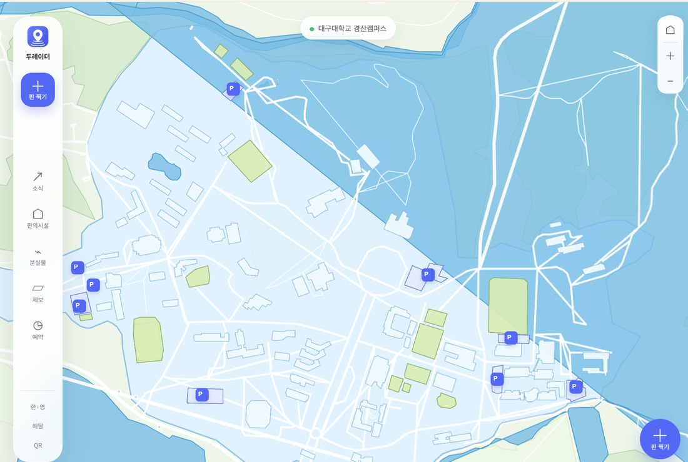

처음 지도를 그렸을 때다. 호수가 캠퍼스를 대각선으로 덮었고 직선이 여기저기 그어졌다. 지도 데이터에서 멀리 떨어진 점 두 개가 한 선으로 이어진 게 원인이었다. 300m 넘게 건너뛰는 선은 끊게 했더니 제대로 나왔다.

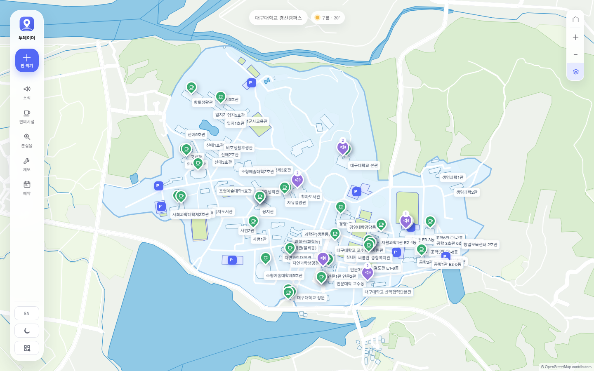

### 폰에서 시트가 핀을 가렸다 (9/17 20시)

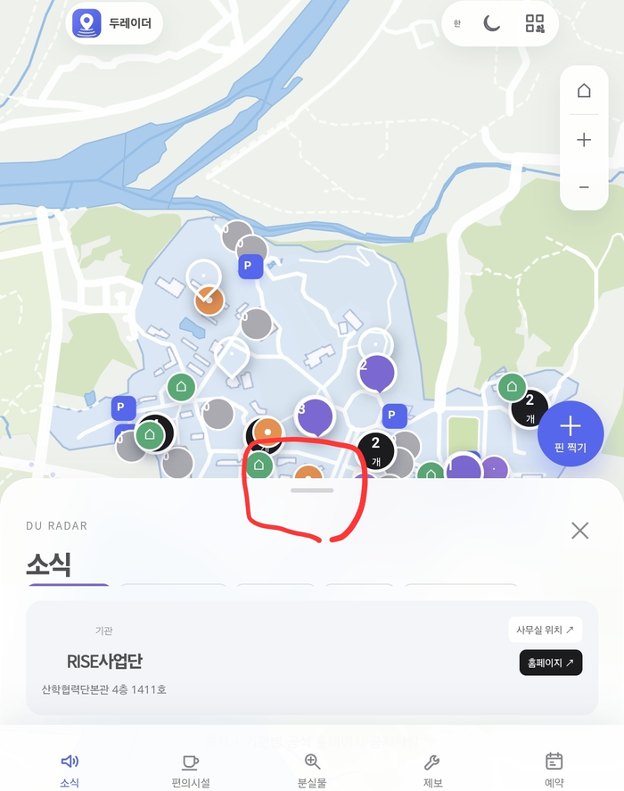

폰으로 열어 보고 제일 먼저 걸린 것. 핀을 누르면 시트가 올라와서 방금 누른 핀을 덮었다. 시트 높이만큼 지도를 위로 옮기게 했는데, 그랬더니 이번엔 시트를 끌 때마다 지도가 덜컹거렸다. 끄는 동안에는 지도를 다시 맞추지 않게 해서 잡았다.

### 어두운 화면 지도 색 (9/18 01시)

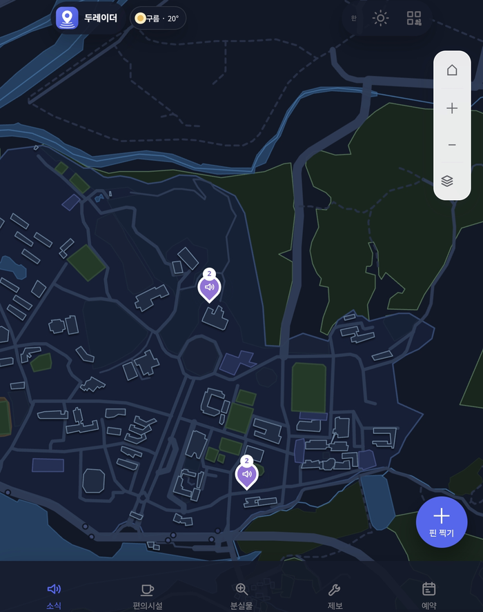

핀이 많아지면서 지도가 느려져서 그리는 방식을 바꿨더니 어두운 화면 색이 다 깨졌다. 한 번 고친 뒤에도 길만 하얗게 빛나서 한 번 더 고쳤다.

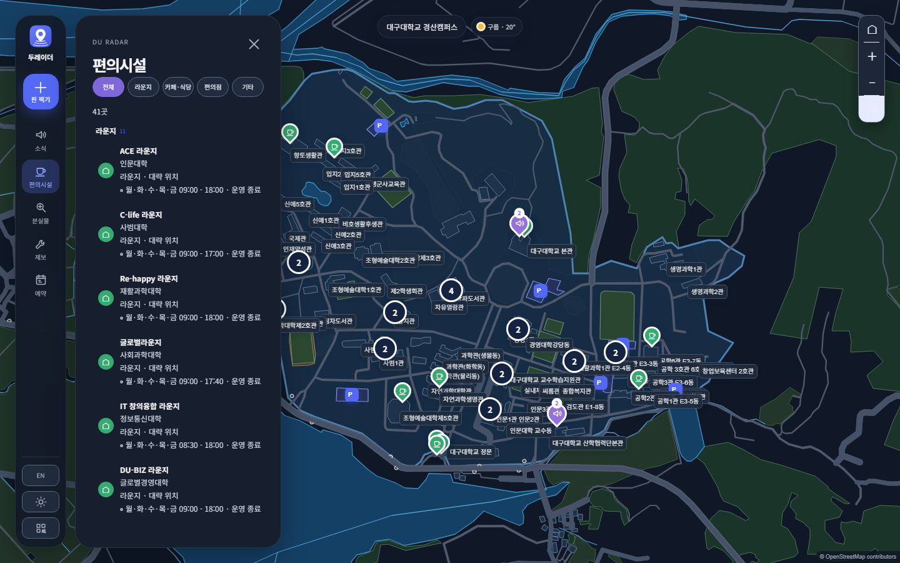

### 폰에서 예약 시트가 화면을 다 덮었다 (9/18 01시)

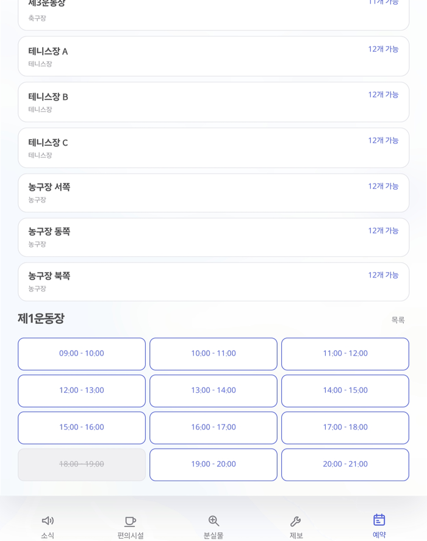

예약을 누르면 시트가 끝까지 올라가서 내릴 수도 없었다. 중간 높이에서 멈추게 했다. 나중에 "가능한 시간 보기"에서 12줄 중에 첫 줄만 보이는 것도 찾아서 같이 고쳤다.

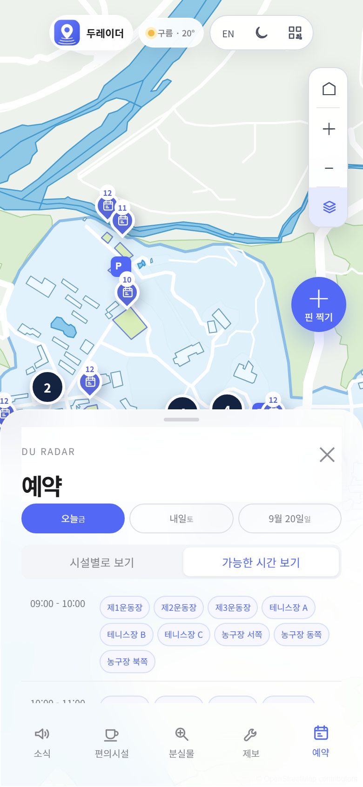

### 태블릿에서 예약 패널만 짧았다 (9/18 02시)

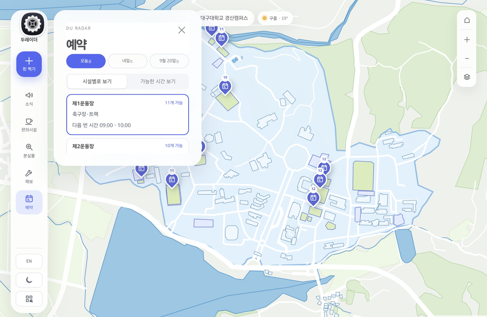

위에서 폰 예약 시트를 중간 높이로 멈추게 한 게 태블릿과 컴퓨터에도 걸려 버렸다. 하나 고치면 다른 데가 틀어지는 일이 밤새 있었다.

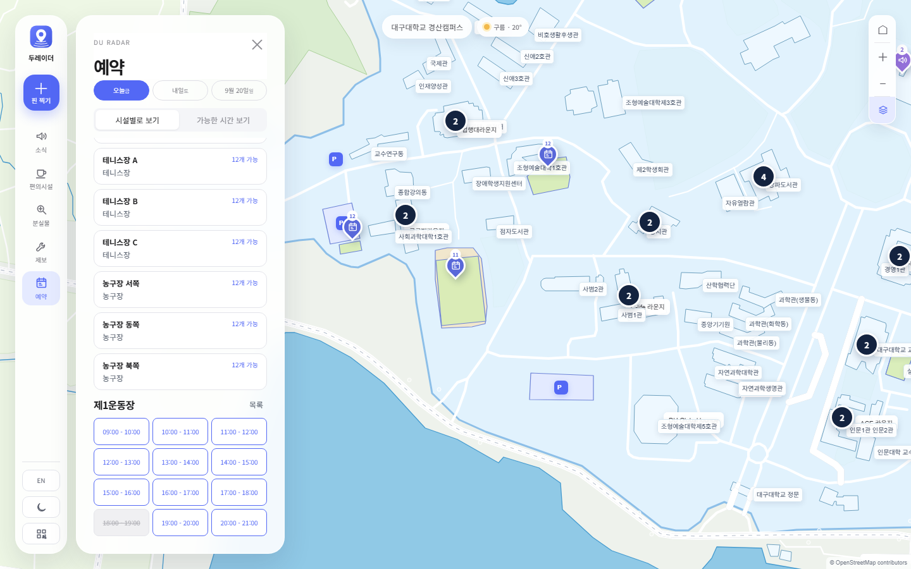

### 폰에서 핀을 못 올렸다 (9/18 05시)

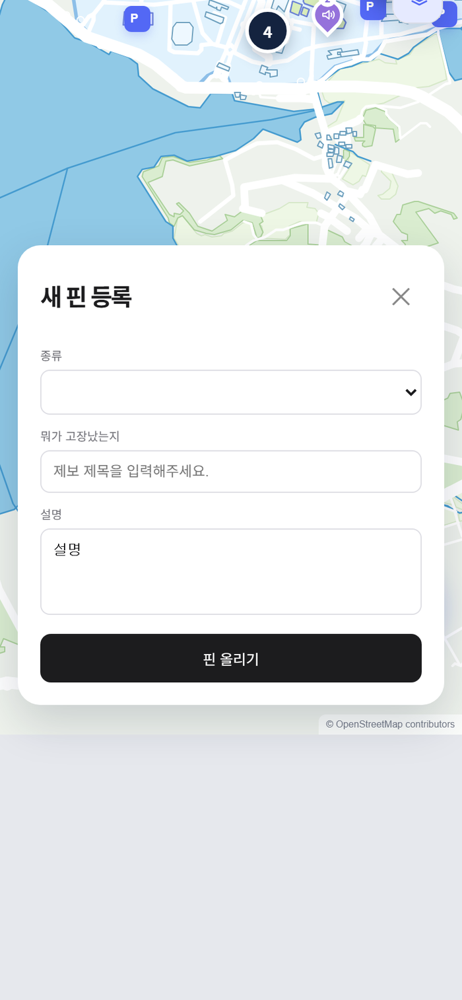

새벽 5시에 폰 크기로 핀 찍기를 처음부터 끝까지 눌러 봤다. 종류 고르는 칸이 비어 있어서 핀을 올릴 수가 없었다. 창 모양도 앱 나머지와 달랐고 지도 아래쪽이 회색으로 비었다. 발표에서 보여줄 화면이라 제일 급했다.

고치고 나니 핀은 올라가는데 올린 뒤에 화면 전체가 위로 밀린 채 안 돌아왔다. 고쳐 달라고 두 번 보냈고 두 번 다 고쳤다는 답이 왔는데, 폰으로 다시 해 보면 그대로였다. 페이지 스크롤도 0 이고 지도 위치도 0 인데 화면만 밀려 있어서 한참 헤맸다. 지도와 아래 탭을 같이 담은 상자가 안쪽으로 스크롤돼 있었다. 글 쓰는 칸을 누를 때 브라우저가 그 상자를 밀어 올리고, 창을 닫아도 안 내려온 것이다. 그걸 그대로 적어 보내니 한 번에 고쳐졌다.

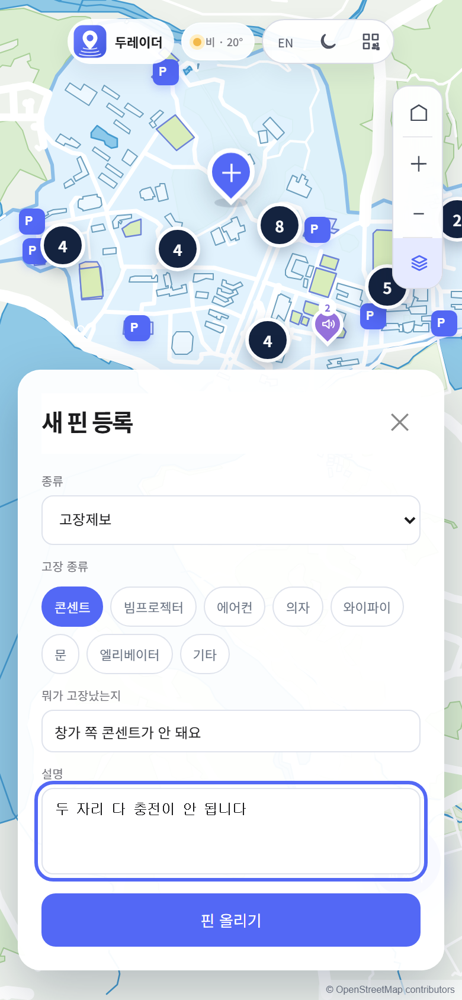

### 그 밖에

- 편의시설 탭에서 "전체"를 골라도 지도에 12곳만 나왔다. 41곳이 다 나와야 했다
- 분실물과 제보 예시 글이 통째로 사라진 적이 있다. 서버 시험을 돌리면서 저장 파일이 비워진 뒤 복구가 안 된 것이었다. 예시 글은 저장 파일이 아니라 따로 둔 파일에서 읽게 바꿨다
- 영어로 바꾸면 메뉴 이름만 영어가 되고 예약 탭은 전부 한글로 남아 있었다
- 탭을 누를 때마다 핀이 깜빡였다. 탭을 바꿀 때마다 핀을 전부 지우고 새로 만들고 있었다
- 지도를 계속 축소하면 세계 지도까지 나왔다. 캠퍼스가 다 보이는 데까지만 줄어들게 막았다

## 돌아보면

고쳤다는 답을 믿고 넘어간 것들이 나중에 다 다시 나왔다. 폰으로 직접 눌러 보기 전에는 된 게 아니었다.

"이상해", "더 예쁘게" 로는 안 고쳐졌다. 뭐가 어디서 어떻게 보이는지 쓰고 숫자를 붙이면 한 번에 됐다.

새벽 2시에 기능 추가를 멈춘 게 맞았다. 그 뒤에 찾은 건 전부 이미 만든 기능이 덜 된 것이었다.

## 발표

발표 때 읽은 글은 [발표-대본.txt](발표-대본.txt) 에 있다. 흩어진 공지와 편의시설 이야기로 시작해서 기능 다섯 개가 각각 뭘 해결하는지 순서대로 말했다.
